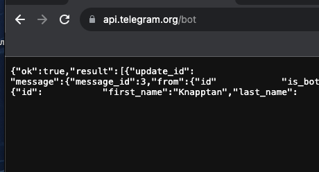

# Basic CI/CD

Разработка простого **CI/CD** для проекта *SimpleBashUtils*. Сборка, тестирование, развертывание.

# Part 1. Настройка **gitlab-runner**

## Поднять виртуальную машину *Ubuntu Server 20.04 LTS*

  

## Скачать и установить на виртуальную машину **gitlab-runner**

Для начала ставим на машину нужные для сборки пакеты

`sudo apt install gcc`

`sudo apt install make`

`sudo apt install clang-format`

Ставим гитлаб раннер

`sudo apt install gitlab-runner`

  

`sudo gitlab-runner start`

При попытке запуска вылетает ошибка 0000

  

Установленный сейчас пакет gitlab-runner из репозитория версия 11.2.0, которая не поддерживается Gitlab.

  

Статья с решением https://stackoverflow.com/questions/65206569/getting-docker-error-while-using-shell-gitlab-runner-erro0000

Устанавливаем последнюю версию gitlab-runner с использованием команд:

`sudo curl -L --output /usr/local/bin/gitlab-runner "https://gitlab-runner-downloads.s3.amazonaws.com/latest/binaries/gitlab-runner-linux-amd64"`

`sudo chmod +x /usr/local/bin/gitlab-runner`

`sudo useradd --comment 'GitLab Runner' --create-home gitlab-runner --shell /bin/bash`

`sudo gitlab-runner install --user=gitlab-runner --working-directory=/home/gitlab-runner`

  

`sudo gitlab-runner start`

`sudo systemctl enable --now gitlab-runner`

## Запустить **gitlab-runner** и зарегистрировать его для использования в текущем проекте (*DO6_CICD*)
- Для регистрации используется URL и токен, с странички задания на платформе.

`sudo gitlab-runner register`

Далее указываем УРЛ

Токен 

Описание например - DO6_CICD progect

Теги build,style,test,deploy

Опици - пропускаем

Выбираем терминал шелл

`sudo gitlab-runner verify`

`sudo gitlab-runner run`

# Part 2. Сборка

## Написать этап для **CI** по сборке приложений из проекта *C2_SimpleBashUtils*:

## В файле _gitlab-ci.yml_ добавить этап запуска сборки через мейк файл из проекта _C2_

## Файлы, полученные после сборки (артефакты), сохранять в произвольную директорию со сроком хранения 30 дней.

Создаём файл `.gitlab-ci.yml` в корне проекта и вписываем туда следующее:  

  

Далее добавляем в `src` `cat` `grep` из проекта `SimpleBash`, пушим и проверяем работу:  

  

  

  

# Part 3. Тест кодстайла

## Написать этап для **CI**, который запускает скрипт кодстайла (*clang-format*):

Для этого пишем дополнительный этап в _gitlab-ci.yml_

  

Проверяем результат, для этого я специально испортил формат кэт 

  

Как видим - проверка прошла - внутри пайплайна есть отображение код стайла

## Если кодстайл не прошел, то "зафейлить" пайплайн

Для этого нам необходимо поймать вывод утилиты *clang-format* и завершить если он есть. 

Проверяем вывод 

  

## В пайплайне отобразить вывод утилиты *clang-format*

`clang-format -n -style=google src/**/*.c src/**/*.h` давет вывод в пайплайне

# Part 4. Интеграционные тесты

## Написать этап для **CI**, который запускает ваши интеграционные тесты из того же проекта:

## Запускать этот этап автоматически только при условии, если сборка и тест кодстайла прошли успешно

## Если тесты не прошли, то "зафейлить" пайплайн

## В пайплайне отобразить вывод, что интеграционные тесты успешно прошли / провалились

Тесты грепа и кета выводят сями по себе результат, по этому пайплайне есть результаты 

Итог выполнения тестов выдает в окружение 1 или 0, в кэт пришлось дописать это, по нему выбиваем ошибку 

Также сборка выдает в окружение 1 или 0

  

Тесты были ориентированы под мак, по этому на линукс часть фейлится, проверим работу ошибки

  

Исправляем - проверяем 

  

# Part 5. Этап деплоя

`-` Для завершения этого задания вы должны перенести исполняемые файлы на другую виртуальную машину, которая будет играть роль продакшена

## Поднять вторую виртуальную машину *Ubuntu Server 20.04 LTS*

 

## Написать этап для **CD**, который "разворачивает" проект на другой виртуальной машине:

Для этого нам необходимо соедить 2 вируальные машины для возможности предачи данных

Настриваем сеть на тип соединения сетевой мост 

 

Таком образом все вируальные машины находятся напрямую в локальной сети 

Запрашиваем новые айпи адреса для машин и пингуем их чтобы проверить соединение 

 

Разворачивание проекта на другой машине будет осуществлятся через ssh туннель.

Сложность этого этапа в провах доступа. Каждый раз запуская скрипт нам требуется доступ к папкам на удаленном сервере. 

Все работы выполняет gitlab-runner обычно через своего одноименного пользователя. 

Необходимо на сервере где запущен gitlab-runner сменить пользователя на gitlab-runner командой 

Но у него нет пароля - даем ему пароль через рут sudo su далее passwd gitlab-runner

Также нужны права - sudo su -l gitlab-runner -s /bin/bash

`su - gitlab-runner`

далее сгенерировать ssh ключ. 

`ssh-keygen`

 

Полученный ключ необходимо внести в файл /.ssh/authorized_keys на удаленном сервере.

Для этого вооспользуемся командой ssh-copy-id user@host где юзер - имя пользователя сервера, хост  - адрес сервера

Однако в моем случае данные оцедуры выполнял пользователь root 

 

По этому ключ необходимо было сделать от пользователя рут sudo su и повторяем предидущие шаги 

После появилась проблема с доступом к папкам на второй машине - не удовалось переместить файлы для этого 

Делаем владельцем директории навторой машине пользователя с первой командой 

`sudo chown -R $(whoami) путь`

## Написать bash-скрипт, который при помощи **ssh** и **scp** копирует файлы, полученные после сборки (артефакты), в директорию */usr/local/bin* второй виртуальной машины

 

## Запускать этот этап вручную при условии, что все предыдущие этапы прошли успешно

## В файле _gitlab-ci.yml_ добавить этап запуска написанного скрипта

 

## В случае ошибки "зафейлить" пайплайн

В результате вы должны получить готовые к работе приложения из проекта *C2_SimpleBashUtils* (s21_cat и s21_grep) на второй виртуальной машине.

 

 

# Part 6. Дополнительно. Уведомления

## Настроить уведомления о успешном/неуспешном выполнении пайплайна через бота с именем "[ваш nickname] DO6 CI/CD" в *Telegram*

Для этого нам необходимо создать бота в ТГ 
это можно сделать через бота BotFather 

 

Пишем боту команды, следуем интрукциям - появлется чат с ботом

Далее идем по адресу https://api.telegram.org/botBOT_TOKEN/getUpdates

Пишем своему боту чтобы проверить соединение и видим текст сообщения  - содиенение готово, берем из него айди чата

 

Далее у нас есть ади чата и токен, для отправки сообщений ботом

На сайте https://api.telegram.org/botBOT_TOKEN/sendMessage передать тест сообщения и айди чата 

Пишем скрипт который мы будем запускать по завершению каждого этапа для отправки результата 

 

добавляем в файл  _gitlab-ci.yml_ зпуск скрипта после выполенения этапа 

 

- Текст уведомления должен содержать информацию об успешности прохождения как этапа **CI**, так и этапа **CD**.

 
